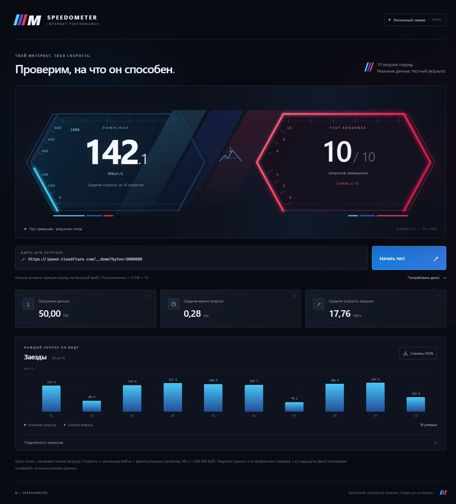

# M Speedometer

Измеритель скорости скачивания с вашего компьютера. **10 последовательных запросов**, реальные байты, среднее время и скорость в **МБ/с** и **Мбит/с**. Плюс анимированная приборка в стиле M: синие и красные шкалы, плавный градиент, график каждого запроса.

## Запуск за минуту

1. **[Скачать ZIP](https://github.com/ArcturUWU/speedometer/archive/refs/heads/main.zip)** → распаковать папку.
2. На Windows дважды нажать **`start.bat`**. Браузер откроется сам.
3. Нажать **«Начать тест»**. Готово: результат появится на приборке и в консоли.

Нужен **Python 3.10 или новее**. Если его нет: [установить Python](https://www.python.org/downloads/) с галочкой **Add python.exe to PATH**, затем снова открыть `start.bat`. Никаких `pip install` и `npm install`.

macOS / Linux: открыть терминал в распакованной папке и выполнить `python3 speedometer.py`.

**Быстрая проверка без интернета:** кнопка «Попробовать демо» показывает анимацию и помечает данные как демонстрационные. Для настоящего замера нажмите «Начать тест». Чтобы остановить приложение, закройте окно консоли.



На скриншоте — пример результата с компьютера разработчика; ваш результат будет зависеть от соединения и сервера.

## Только скрипт — для задания

```sh
python speedometer.py --cli "https://speed.cloudflare.com/__down?bytes=5000000"
```

Замените URL ссылкой на **сам файл**: картинку, архив или другой HTTP/HTTPS-ресурс. Программа выполнит 10 GET-запросов **по одному**, полностью скачает каждый ответ и напечатает размер, время и итоговую скорость.

```text
[01/10] ... MB | ... s | ... MB/s
...
Average request: ... s
Downloaded: ... MB
Speed: ... MB/s (... Mbps)
```

Машиночитаемый результат: `python speedometer.py --cli "URL" --json`.

Сохранить JSON: `python speedometer.py --cli "URL" --output result.json`.

Другой таймаут: `python speedometer.py --cli "URL" --timeout 30`.

Если URL подписан или сервер запрещает лишние параметры: добавьте `--no-cache-bust`. По умолчанию к каждому запросу добавляется уникальный параметр, чтобы уменьшить влияние кеша; остальные параметры сохраняются.

## Что именно измеряется

По умолчанию используется [download endpoint Cloudflare](https://github.com/cloudflare/speedtest): **5 000 000 байт × 10 = 50 МБ** трафика. В поле адреса можно вставить свою ссылку. Файлы не сохраняются на диск: программа читает ответ потоком и считает полученные байты. Ответы не распаковываются; запрашивается `Accept-Encoding: identity`.

Тяжёлая картинка подойдёт, но тестовый файл удобнее: его размер заранее известен. Крошечный файл сильнее отражает задержку соединения и работу сервера. Для очень быстрой линии можно увеличить `bytes=5000000` до `bytes=20000000` (тогда тест скачает 200 МБ).

Формулы для успешно завершённых запросов:

```text
Среднее время = сумма времени запросов / число успешных запросов
МБ/с = сумма скачанных байтов / сумма времени запросов / 1 000 000
Мбит/с = МБ/с × 8
```

Время начинается **до подключения** и заканчивается после чтения тела ответа: DNS, подключение, TLS и ожидание сервера входят в результат. Это последовательный замер скачивания до выбранного сервера; он может быть ниже пропускной способности тарифа. Upload и ping не измеряются. Итоговая скорость — отношение общего объёма ко времени, а не среднее арифметическое десяти скоростей. Анимация плавно отображает реальные измерения и не меняет итоговую статистику.

Ошибки, пустые и оборванные ответы показаны отдельно. Если хотя бы один запрос не удался, результат помечается как неполный, CLI завершается с ненулевым кодом. Частичные байты ошибочных запросов не входят в итоговую скорость. Отмена также не выдаёт неполный тест за успешные 10 запросов.

Лимит — 100 МБ на один ответ; таймаут по умолчанию — 15 секунд на запрос. Интерфейс работает локально на `127.0.0.1`, скачивания выполняет Python на вашем компьютере, поэтому браузерный CORS целевого сервера не мешает замеру.

## Проверка

```sh
python -m unittest discover -s tests -v
```

Тесты используют локальный HTTP-сервер; интернет не нужен. Проверяются последовательность запросов, байты и формулы, ошибки HTTP, оборванный ответ, таймаут, ограничение размера и отмена.

Если порт занят: `python speedometer.py --port 0`. Если браузер не открылся, скопируйте адрес из консоли. Если сервер по вашей ссылке не отвечает, попробуйте другой прямой URL или «Демо» для проверки интерфейса.

Приборка — авторская стилизация по мотивам M-инструментов; проект не связан с BMW, Ookla или Cloudflare. В проекте нет сторонних изображений, шрифтов, аналитики и зависимостей.
